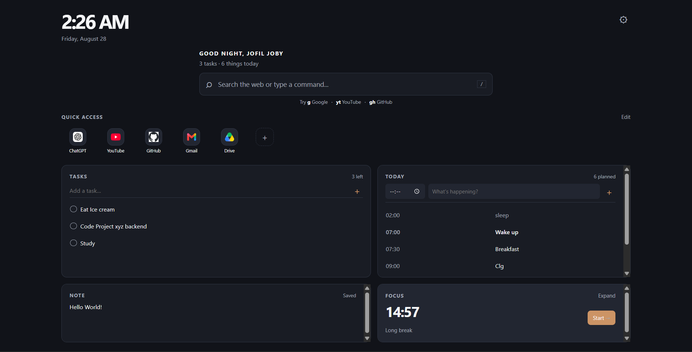
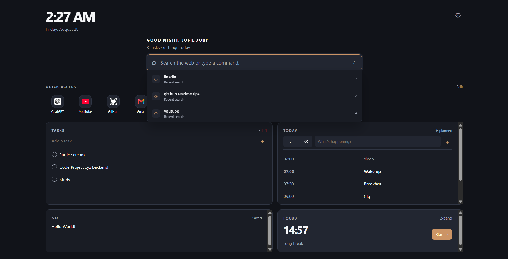
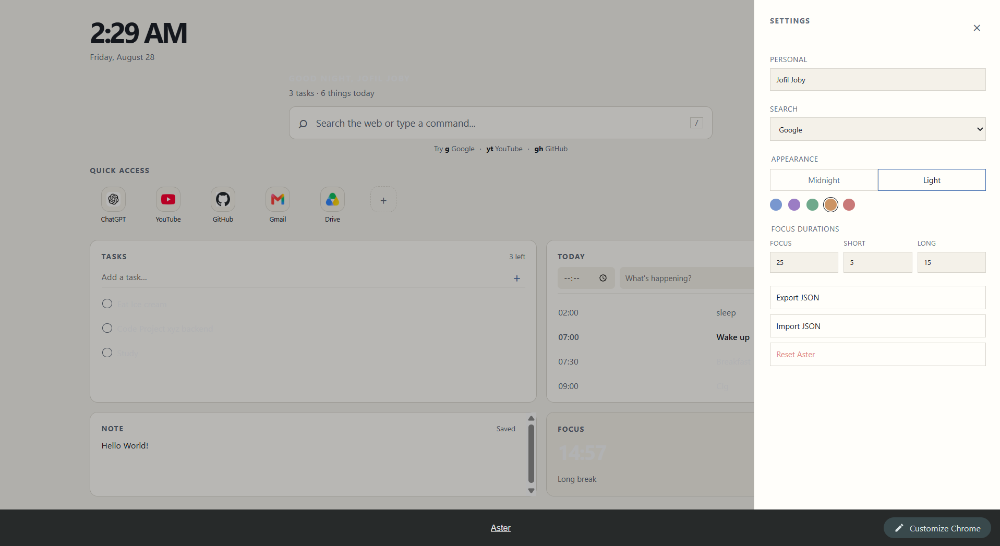
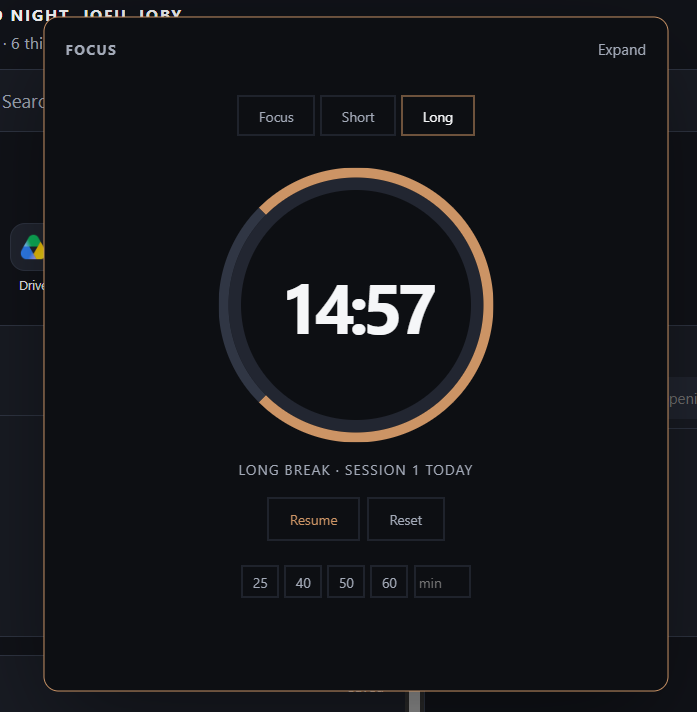

# Aster

> **A focused Chrome new-tab dashboard for a calmer start to every session.**

Aster transforms Chrome's default new tab into a lightweight personal workspace for **search, tasks, planning, notes, shortcuts, and focused work**.

Designed to stay useful without becoming another productivity app that requires twelve settings pages and a subscription to remember your own name.

## ✦ What Aster Does

- **Search** the web from one focused command bar
- **Quick access** to the sites you use most
- **Tasks** for lightweight daily to-dos
- **Today** for time-based planning
- **Notes** for temporary thoughts and reminders
- **Focus timer** with Focus, Short Break, and Long Break modes
- **Midnight & Light themes** with accent customization
- **Local persistence** through Chrome Storage
- **Import / Export** for backing up your Aster data
- **First-run onboarding** for a personalized setup

## Preview

These are the **real Aster screenshots from the project**, showing the dashboard, search interaction, settings/light theme, and expanded Focus timer.

### Dashboard

<p align="center">
  
</p>

### Search

<p align="center">
  
</p>

### Light Theme & Settings

<p align="center">
  
</p>

### Focus Timer

<p align="center">
  
</p>

## Features

### Search & Commands

Search directly from the new tab and use command prefixes to route searches to specific services.

```text
hello world        → selected search engine
g hello world      → Google
yt javascript      → YouTube
gh chrome api      → GitHub
```

Supported search engines include **Google, Bing, DuckDuckGo, and Brave**.

### Quick Access

Keep frequently visited websites one click away. Shortcuts can be added and edited directly from the dashboard.

### Tasks

A simple task list for the things that need doing today, without turning a five-item to-do list into a project-management ceremony.

### Today

Add time-based entries to build a lightweight daily schedule directly into the new-tab page.

### Notes

A persistent scratchpad for information you'll need later.

### Focus Timer

A built-in focus workflow with:

- Focus sessions
- Short breaks
- Long breaks
- Preset durations
- Custom durations
- Pause and reset controls

### Themes

Choose between:

- Midnight
- Light
- Custom accent colors

Theme values are driven by CSS variables, allowing the interface to stay visually consistent when the appearance changes.

## Tech Stack

| Technology | Use |
|---|---|
| HTML5 | Dashboard structure |
| CSS3 | Layout, themes, components, responsive styling |
| JavaScript | Application logic and UI behavior |
| ES Modules | Modular client-side architecture |
| Chrome Manifest V3 | Extension platform |
| Chrome Storage API | Local persistence |
| Chrome Alarms API | Timer/background behavior |

## Architecture

Aster keeps its functionality split into small browser-native modules:

```text
aster/
├── assets/
│   └── icons/
├── css/
│   ├── variables.css
│   ├── layout.css
│   ├── components.css
│   ├── refine.css
│   └── search-polish.css
├── js/
│   ├── app.js
│   ├── background.js
│   ├── clock.js
│   ├── notes.js
│   ├── search.js
│   ├── settings.js
│   ├── shortcuts.js
│   ├── storage.js
│   ├── tasks.js
│   ├── timer.js
│   └── today.js
├── index.html
└── manifest.json
```

The new-tab dashboard is registered through Chrome's `chrome_url_overrides.newtab`, while background behavior is handled by the extension service worker.

## Installation

Aster currently runs as an unpacked Chrome extension.

### 1. Clone the repository

```bash
git clone https://github.com/Jofil-Joby/Aster.git
cd Aster
```

### 2. Open Chrome Extensions

Go to:

```text
chrome://extensions
```

Enable **Developer mode**.

### 3. Load Aster

Click **Load unpacked** and select the `aster` folder.

### 4. Open a new tab

Aster should now replace Chrome's default new-tab page.

## Permissions

Aster uses only the permissions required for its core functionality:

| Permission | Why it is used |
|---|---|
| `storage` | Save tasks, notes, shortcuts, settings, and other local data |
| `alarms` | Support timer-related background behavior |

The extension also overrides Chrome's new-tab page through Manifest V3 configuration.

## Privacy

Aster is designed around local browser storage and does not require an account for its core functionality.

Tasks, notes, shortcuts, settings, and other dashboard data are stored through Chrome's storage API. Search requests are sent to the search provider selected by the user, as expected from a web-search feature.

There is no application backend or sign-in requirement for the dashboard.

## Development

Aster has no dependency installation or build step. It uses browser-native HTML, CSS, and JavaScript modules.

### Development workflow

1. Edit files inside `aster/`.
2. Open `chrome://extensions`.
3. Click **Reload** on Aster.
4. Open a new tab and test the change.
5. Check both Midnight and Light themes when changing visual styles.

## Roadmap

- [ ] Chrome Web Store release
- [ ] Drag-and-drop shortcut organization
- [ ] Improved keyboard navigation
- [ ] Expanded accessibility support
- [ ] Additional productivity integrations
- [ ] More dashboard customization
- [ ] Optional cross-device synchronization
- [ ] Automated extension testing

## Design Direction

Aster follows a simple visual principle:

> **Less interface, more focus.**

The UI uses a restrained palette, large typography for time, subtle borders, compact controls, and a warm accent color to make important actions noticeable without turning the dashboard into a colorful control panel.

## Contributing

Contributions, bug reports, and UI ideas are welcome. See [`CONTRIBUTING.md`](CONTRIBUTING.md) for the development and contribution guidelines.

## Changelog

See [`CHANGELOG.md`](CHANGELOG.md) for notable project changes.

## License

This project is licensed under the MIT License. See [`LICENSE`](LICENSE) for details.

## Author

**Jofil Joby**

- GitHub: [@Jofil-Joby](https://github.com/Jofil-Joby)

---

<div align="center">

**Aster** · A calmer place to begin.

</div>
